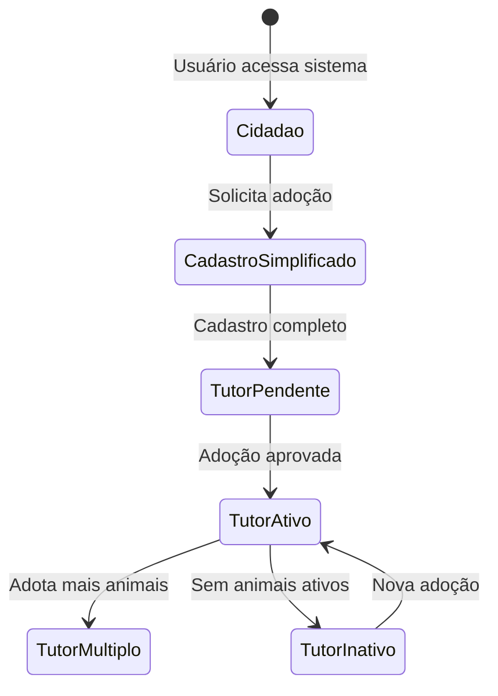

# 🚀 DIBEA - Expansão de Funcionalidades Avançadas

## 🎯 **VISÃO GERAL**

Este documento expande as funcionalidades do chat conversacional do DIBEA com base em novos insights sobre interações de usuários, agendamentos, gestão veterinária e campanhas em lote.

---

## 🔄 **1. TRANSIÇÃO DE ROLES: CIDADÃO → TUTOR**

### **Conceito:**
Um cidadão comum se torna automaticamente um **TUTOR** quando adota seu primeiro animal. Esta transição deve ser transparente e gerenciada pelo sistema.

### **Fluxo de Transição:**



### **Implementação no Chat:**

#### **Cenário 1: Primeira Adoção**
```
👤 Cidadão: "Quero adotar a Luna"

🤖 DIBEA: "Que ótimo! Para continuar com a adoção, preciso fazer seu cadastro como tutor. 📝

Vou precisar de algumas informações:
- Nome completo:
- CPF:
- Telefone:
- Email:
- Endereço completo:
- Tipo de moradia: (Casa/Apartamento/Sítio)
- Tem outros pets? (Sim/Não)
- Tem quintal? (Sim/Não)

Pode me enviar essas informações?"

👤 Cidadão: [envia dados]

🤖 DIBEA: "Perfeito! Seu cadastro como tutor foi criado! ✅

📋 **Seu perfil:**
- Nome: João Silva
- CPF: ***.456.789-**
- Status: Tutor Ativo
- Município: São Paulo

Agora você pode:
✅ Solicitar adoções
✅ Agendar consultas
✅ Participar de campanhas
✅ Acompanhar seus animais

Vamos continuar com a adoção da Luna?"
```

### **Edge Functions Necessárias:**

#### **31. promote_to_tutor**
```typescript
// Promove cidadão a tutor automaticamente
// Permissões: Sistema (automático) ou Staff
{
  user_id: uuid,
  tutor_data: {
    cpf: string,
    rg?: string,
    nome: string,
    email: string,
    telefone: string,
    endereco_completo: string,
    cep: string,
    tipo_moradia: "CASA" | "APARTAMENTO" | "SITIO" | "OUTROS",
    tem_experiencia: boolean,
    observacoes?: text
  },
  trigger: "ADOPTION" | "MANUAL"
}
```

#### **32. check_tutor_status**
```typescript
// Verifica se usuário já é tutor
// Permissões: Todos
{
  user_identifier: string, // CPF ou telefone
  return_profile: boolean
}
```

---

## 🏥 **2. AGENDAMENTOS DUPLOS: DIBEA + CLÍNICAS EXTERNAS**

### **Conceito:**
Usuários podem agendar:
1. **Procedimentos no DIBEA** (castração, vacinação, microchipagem)
2. **Consultas em clínicas parceiras** (consultas, exames, cirurgias)

### **Estrutura de Dados Expandida:**

```typescript
interface Agendamento {
  id: uuid
  tipo: "VISITA_ADOCAO" | "PROCEDIMENTO_DIBEA" | "CONSULTA_CLINICA" | "CAMPANHA"
  local_type: "DIBEA" | "CLINICA_PARCEIRA"
  clinica_id?: uuid // Se for clínica externa
  data_hora: datetime
  duracao_minutos: number
  tutor_id: uuid
  animal_id?: uuid
  veterinario_id?: uuid
  servico: string // "Castração", "Consulta", "Vacinação", etc.
  valor?: decimal
  status: "AGENDADO" | "CONFIRMADO" | "REALIZADO" | "CANCELADO" | "FALTOU"
  observacoes?: text
  lembrete_enviado: boolean
  municipio_id: uuid
}

interface Clinica {
  id: uuid
  nome: string
  cnpj: string
  endereco: string
  telefone: string
  email: string
  horario_funcionamento: json // { "seg": ["08:00-12:00", "14:00-18:00"], ... }
  servicos_oferecidos: string[] // ["Consulta", "Cirurgia", "Exames", ...]
  veterinarios: uuid[]
  aceita_convenio_dibea: boolean
  desconto_dibea: decimal
  municipio_id: uuid
  ativo: boolean
}
```

### **Fluxo no Chat:**

#### **Cenário 2: Agendar Consulta em Clínica**
```
👤 Tutor: "Preciso agendar consulta para a Luna"

🤖 DIBEA: "Claro! Onde você prefere fazer a consulta? 🏥

1. 🏛️ Centro Veterinário Municipal (DIBEA)
   - Gratuito para tutores cadastrados
   - Horários: Seg-Sex 8h-17h

2. 🏥 Clínicas Parceiras
   - Desconto de 20% para tutores DIBEA
   - Mais opções de horários
   - Especialidades disponíveis

Qual você prefere?"

👤 Tutor: "Clínicas parceiras"

🤖 DIBEA: "Ótimo! Temos 3 clínicas parceiras em São Paulo:

1. **Clínica VetCare**
   📍 Rua das Flores, 123 - Centro
   ⏰ Seg-Sáb 8h-20h
   💰 Consulta: R$ 120 (R$ 96 com desconto DIBEA)
   ⭐ 4.8/5 (234 avaliações)

2. **Hospital Veterinário PetLife**
   📍 Av. Paulista, 456 - Bela Vista
   ⏰ 24h (emergências)
   💰 Consulta: R$ 150 (R$ 120 com desconto DIBEA)
   ⭐ 4.9/5 (567 avaliações)

3. **Clínica Animal Care**
   📍 Rua dos Animais, 789 - Jardins
   ⏰ Seg-Sex 9h-18h
   💰 Consulta: R$ 100 (R$ 80 com desconto DIBEA)
   ⭐ 4.7/5 (189 avaliações)

Qual você escolhe?"

👤 Tutor: "VetCare"

🤖 DIBEA: "Perfeito! Clínica VetCare selecionada! 🏥

📅 **Horários disponíveis:**

**Esta semana:**
- Qui (01/10) às 10h - Dr. Carlos Silva
- Qui (01/10) às 14h - Dra. Maria Santos
- Sex (02/10) às 09h - Dr. Carlos Silva
- Sex (02/10) às 16h - Dra. Ana Costa

**Próxima semana:**
- Seg (05/10) às 10h - Dr. Carlos Silva
- Ter (06/10) às 14h - Dra. Maria Santos

Qual horário prefere?"

👤 Tutor: "Quinta às 10h"

🤖 DIBEA: "Agendamento confirmado! ✅

📋 **Detalhes da Consulta:**
- Animal: Luna
- Data: 01/10/2025 às 10h
- Local: Clínica VetCare
- Endereço: Rua das Flores, 123 - Centro
- Veterinário: Dr. Carlos Silva (CRMV-SP 12345)
- Valor: R$ 96,00 (com desconto DIBEA 20%)
- Protocolo: #CON-2025-007890

📱 **Próximos passos:**
1. Leve a carteira de vacinação da Luna
2. Chegue 10 minutos antes
3. Apresente seu CPF para validar desconto DIBEA
4. Lembrete será enviado 1 dia antes

💳 **Pagamento:** Direto na clínica

Alguma dúvida?"
```

### **Edge Functions Necessárias:**

#### **33. search_clinics**
```typescript
// Buscar clínicas parceiras
// Permissões: Todos
{
  municipality_id: uuid,
  service_type?: string,
  available_date?: date,
  max_distance_km?: number,
  accepts_dibea?: boolean
}
```

#### **34. get_clinic_availability**
```typescript
// Horários disponíveis em clínica
// Permissões: Todos
{
  clinic_id: uuid,
  service_type: string,
  date_from: date,
  date_to: date,
  veterinarian_id?: uuid
}
```

#### **35. create_clinic_appointment**
```typescript
// Criar agendamento em clínica
// Permissões: Tutor, Staff
{
  clinic_id: uuid,
  tutor_id: uuid,
  animal_id: uuid,
  service_type: string,
  date_time: datetime,
  veterinarian_id?: uuid,
  observations?: text
}
```

---

## 💊 **3. FUNCIONALIDADES VETERINÁRIAS AVANÇADAS**

### **Conceito:**
Veterinários podem registrar informações detalhadas sobre atendimentos, incluindo:
- **Receitas médicas**
- **Laudos de exames**
- **Produtos utilizados/prescritos**
- **Procedimentos realizados**
- **Anotações clínicas**

### **Estrutura de Dados Expandida:**

```typescript
interface HistoricoMedicoDetalhado {
  id: uuid
  animal_id: uuid
  veterinario_id: uuid
  data_atendimento: datetime
  tipo: "CONSULTA" | "CIRURGIA" | "EXAME" | "VACINACAO" | "EMERGENCIA"
  
  // Dados clínicos
  peso_animal: decimal
  temperatura?: decimal
  frequencia_cardiaca?: number
  frequencia_respiratoria?: number
  
  // Anamnese
  queixa_principal: text
  historico_doenca_atual: text
  exame_fisico: text
  
  // Diagnóstico
  diagnostico_presuntivo: text
  diagnostico_definitivo?: text
  cid_veterinario?: string
  
  // Tratamento
  conduta: text
  observacoes: text
  
  // Relacionamentos
  receitas: Receita[]
  laudos: Laudo[]
  produtos_utilizados: ProdutoUtilizado[]
  
  // Controle
  retorno_recomendado?: date
  status: "EM_ANDAMENTO" | "CONCLUIDO"
  created_at: timestamp
  updated_at: timestamp
}

interface Receita {
  id: uuid
  historico_medico_id: uuid
  numero_receita: string
  data_emissao: date
  validade_dias: number
  medicamentos: Medicamento[]
  observacoes?: text
  pdf_url: string
  assinatura_digital: string
  created_at: timestamp
}

interface Medicamento {
  id: uuid
  receita_id: uuid
  nome: string
  principio_ativo: string
  dosagem: string
  via_administracao: "ORAL" | "TOPICA" | "INJETAVEL" | "OUTRA"
  frequencia: string // "8/8h", "12/12h", "1x ao dia"
  duracao_dias: number
  quantidade_total: string
  instrucoes: text
}

interface Laudo {
  id: uuid
  historico_medico_id: uuid
  tipo: "EXAME_SANGUE" | "RAIO_X" | "ULTRASSOM" | "BIOPSIA" | "OUTRO"
  data_realizacao: date
  laboratorio?: string
  resultado: text
  interpretacao: text
  arquivos: string[] // URLs dos PDFs/imagens
  created_at: timestamp
}

interface ProdutoUtilizado {
  id: uuid
  historico_medico_id: uuid
  produto_id: uuid
  quantidade: decimal
  unidade: string
  lote?: string
  validade?: date
  valor_unitario?: decimal
  valor_total?: decimal
}

interface Produto {
  id: uuid
  nome: string
  categoria: "MEDICAMENTO" | "VACINA" | "MATERIAL_CIRURGICO" | "CONSUMIVEL"
  fabricante: string
  codigo_barras?: string
  estoque_atual: number
  estoque_minimo: number
  unidade: string
  valor_custo: decimal
  valor_venda?: decimal
  requer_receita: boolean
  controlado: boolean
  municipio_id: uuid
}
```

### **Fluxo no Chat:**

#### **Cenário 3: Veterinário Registra Atendimento Completo**
```
👤 Veterinário: "Registrar atendimento do animal ae79feeb-be25-4598-8e81-b6a95ba28790"

🤖 DIBEA: "Vou registrar o atendimento do **Thor**! 🏥

Por favor, informe:

**1. Dados Vitais:**
- Peso: (kg)
- Temperatura: (°C) [opcional]
- FC: (bpm) [opcional]
- FR: (mpm) [opcional]

**2. Anamnese:**
- Queixa principal:
- Histórico:

**3. Exame Físico:**
- Descrição:

**4. Diagnóstico:**
- Diagnóstico:

**5. Conduta:**
- Tratamento prescrito:

Pode enviar as informações?"

👤 Veterinário: "
Peso: 35kg
Temperatura: 38.5°C
FC: 90bpm
FR: 25mpm

Queixa: Tosse há 3 dias
Histórico: Animal saudável, vacinação em dia

Exame: Auscultação pulmonar com sibilos discretos, mucosas rosadas, TPC<2s

Diagnóstico: Traqueobronquite infecciosa canina (Tosse dos Canis)

Conduta: Antibioticoterapia + antitussígeno + repouso
"

🤖 DIBEA: "Atendimento registrado! ✅

Agora vou gerar a receita. Quais medicamentos você prescreveu?

**Formato:**
- Medicamento 1: [nome] [dosagem] [via] [frequência] [duração]
- Medicamento 2: ...

Exemplo:
- Amoxicilina 500mg VO 12/12h 7 dias
- Dextrometorfano 15mg VO 8/8h 5 dias"

👤 Veterinário: "
- Amoxicilina + Clavulanato 500mg VO 12/12h 10 dias
- Dextrometorfano 15mg VO 8/8h 5 dias
- Prednisolona 5mg VO 1x ao dia 3 dias
"

🤖 DIBEA: "Receita gerada! 📋

📄 **Receita Médica #REC-2025-001234**
- Veterinário: Dr. Carlos Silva (CRMV-SP 12345)
- Animal: Thor (Canino, Pastor Alemão)
- Tutor: João Silva (CPF: ***.456.789-**)
- Data: 29/09/2025
- Validade: 30 dias

**Medicamentos:**
1. Amoxicilina + Clavulanato 500mg
   - Via: Oral
   - Posologia: 12/12h por 10 dias
   - Quantidade: 20 comprimidos

2. Dextrometorfano 15mg
   - Via: Oral
   - Posologia: 8/8h por 5 dias
   - Quantidade: 15 comprimidos

3. Prednisolona 5mg
   - Via: Oral
   - Posologia: 1x ao dia por 3 dias
   - Quantidade: 3 comprimidos

**Observações:** Manter animal em repouso. Retornar em 7 dias para reavaliação.

✅ Receita assinada digitalmente
📧 Enviada para o tutor por email
📱 Notificação enviada via WhatsApp

Deseja:
1. Registrar produtos utilizados na consulta
2. Solicitar exames
3. Agendar retorno
4. Finalizar atendimento"

👤 Veterinário: "Registrar produtos: Seringa 3ml (2 unidades), Agulha 25x7 (2 unidades)"

🤖 DIBEA: "Produtos registrados! ✅

💊 **Produtos Utilizados:**
- Seringa 3ml: 2 unidades (Lote: L123456)
- Agulha 25x7: 2 unidades (Lote: L789012)

📊 **Estoque atualizado automaticamente**

Deseja agendar retorno?"

👤 Veterinário: "Sim, 7 dias"

🤖 DIBEA: "Retorno agendado! 📅

📋 **Agendamento de Retorno:**
- Data: 06/10/2025 às 10h
- Animal: Thor
- Veterinário: Dr. Carlos Silva
- Motivo: Reavaliação pós-tratamento
- Protocolo: #RET-2025-007891

✅ Tutor notificado
✅ Lembrete programado

**Resumo do Atendimento:**
- Atendimento: #ATD-2025-001234
- Receita: #REC-2025-001234
- Retorno: #RET-2025-007891
- Duração: 25 minutos
- Status: Concluído

Tudo certo! 👍"
```

### **Edge Functions Necessárias:**

#### **36. create_detailed_medical_record**
```typescript
// Registrar atendimento completo
// Permissões: Veterinário, Admin
{
  animal_id: uuid,
  veterinario_id: uuid,
  clinical_data: {
    peso: decimal,
    temperatura?: decimal,
    fc?: number,
    fr?: number
  },
  anamnesis: {
    queixa_principal: text,
    historico: text,
    exame_fisico: text
  },
  diagnosis: {
    presuntivo: text,
    definitivo?: text,
    cid?: string
  },
  treatment: {
    conduta: text,
    observacoes: text
  },
  return_date?: date
}
```

#### **37. create_prescription**
```typescript
// Gerar receita médica
// Permissões: Veterinário, Admin
{
  historico_medico_id: uuid,
  medications: Array<{
    nome: string,
    principio_ativo: string,
    dosagem: string,
    via: string,
    frequencia: string,
    duracao_dias: number,
    quantidade: string,
    instrucoes?: text
  }>,
  observacoes?: text,
  validade_dias: number
}
```

#### **38. register_products_used**
```typescript
// Registrar produtos utilizados
// Permissões: Veterinário, Funcionário, Admin
{
  historico_medico_id: uuid,
  products: Array<{
    produto_id: uuid,
    quantidade: decimal,
    lote?: string
  }>
}
```

#### **39. upload_lab_result**
```typescript
// Upload de laudo de exame
// Permissões: Veterinário, Admin
{
  historico_medico_id: uuid,
  tipo: string,
  data_realizacao: date,
  laboratorio?: string,
  resultado: text,
  interpretacao: text,
  files: Array<File>
}
```

---

## 📅 **4. CAMPANHAS EM LOTE COM HORÁRIOS ESPECÍFICOS**

### **Conceito:**
Admins e funcionários podem criar campanhas com:
- **Horários específicos** (ex: segunda de manhã apenas)
- **Vagas limitadas por horário**
- **Inscrições em lote**
- **Notificações automáticas**

### **Estrutura de Dados Expandida:**

```typescript
interface CampanhaDetalhada {
  id: uuid
  nome: string
  tipo: "CASTRACAO" | "VACINACAO" | "MICROCHIPAGEM" | "EDUCATIVA"
  descricao: text
  data_inicio: date
  data_fim: date
  
  // Configuração de horários
  horarios_config: {
    dias_semana: number[] // [1=seg, 2=ter, ..., 7=dom]
    horario_inicio: time
    horario_fim: time
    duracao_atendimento_minutos: number
    intervalo_entre_atendimentos_minutos: number
    vagas_por_horario: number
  }
  
  // Localização
  local: string
  endereco: string
  latitude?: decimal
  longitude?: decimal
  
  // Financeiro
  valor: decimal
  gratuita: boolean
  desconto_percentual?: decimal
  
  // Controle
  vagas_total: number
  vagas_ocupadas: number
  lista_espera: boolean
  
  // Requisitos
  requisitos: string[] // ["Animal castrado", "Vacinação em dia", ...]
  publico_alvo: "TODOS" | "TUTORES" | "ANIMAIS_RESGATADOS"
  
  // Status
  status: "PLANEJADA" | "INSCRICOES_ABERTAS" | "EM_ANDAMENTO" | "ENCERRADA" | "CANCELADA"
  
  municipio_id: uuid
  created_by: uuid
  created_at: timestamp
}

interface InscricaoCampanha {
  id: uuid
  campanha_id: uuid
  tutor_id: uuid
  animal_id: uuid
  data_hora_agendada: datetime
  posicao_fila?: number // Se lista de espera
  status: "CONFIRMADA" | "LISTA_ESPERA" | "REALIZADA" | "FALTOU" | "CANCELADA"
  observacoes?: text
  created_at: timestamp
}
```

### **Fluxo no Chat:**

#### **Cenário 4: Admin Cria Campanha de Vacinação**
```
👤 Admin: "Criar campanha de vacinação"

🤖 DIBEA: "Vou te ajudar a criar a campanha! 📋

**1. Informações Básicas:**
- Nome da campanha:
- Tipo: (CASTRACAO/VACINACAO/MICROCHIPAGEM/EDUCATIVA)
- Descrição:
- Data início:
- Data fim:

Pode enviar?"

👤 Admin: "
Nome: Campanha de Vacinação Antirrábica 2025
Tipo: VACINACAO
Descrição: Vacinação gratuita contra raiva para cães e gatos
Data início: 05/10/2025
Data fim: 09/10/2025
"

🤖 DIBEA: "Ótimo! Agora vamos configurar os horários. 📅

**2. Configuração de Horários:**
- Dias da semana: (1=Seg, 2=Ter, 3=Qua, 4=Qui, 5=Sex, 6=Sáb, 7=Dom)
- Horário início:
- Horário fim:
- Duração por atendimento: (minutos)
- Intervalo entre atendimentos: (minutos)
- Vagas por horário:

Exemplo: 
Dias: 1,2,3,4,5 (Seg a Sex)
Horário: 08:00 às 12:00
Duração: 10 minutos
Intervalo: 5 minutos
Vagas: 2"

👤 Admin: "
Dias: 1 (apenas segunda-feira)
Horário: 08:00 às 12:00
Duração: 10 minutos
Intervalo: 5 minutos
Vagas: 2
"

🤖 DIBEA: "Perfeito! Vou calcular as vagas... 🔢

📊 **Resumo da Campanha:**

**Informações:**
- Nome: Campanha de Vacinação Antirrábica 2025
- Tipo: Vacinação
- Período: 05/10 a 09/10/2025
- Dias: Apenas segundas-feiras (05/10)

**Horários:**
- Horário: 08:00 às 12:00
- Duração: 10 min por animal
- Intervalo: 5 min
- Total de slots: 16 horários
- Vagas por horário: 2 animais
- **Total de vagas: 32 animais**

**Horários disponíveis:**
- 08:00, 08:15, 08:30, 08:45
- 09:00, 09:15, 09:30, 09:45
- 10:00, 10:15, 10:30, 10:45
- 11:00, 11:15, 11:30, 11:45

**3. Local e Valor:**
- Local:
- Endereço:
- Valor: (R$ ou GRATUITA)
- Aceita lista de espera? (Sim/Não)"

👤 Admin: "
Local: Centro de Zoonoses
Endereço: Rua das Flores, 123 - Centro - São Paulo/SP
Valor: GRATUITA
Lista de espera: Sim
"

🤖 DIBEA: "Campanha criada com sucesso! 🎉

📋 **Campanha #CAMP-2025-001234**

✅ 32 vagas disponíveis
✅ Inscrições abertas
✅ Lista de espera ativada
✅ Notificações programadas

**Ações disponíveis:**
1. Divulgar campanha (enviar notificações)
2. Ver inscrições
3. Editar campanha
4. Cancelar campanha

O que deseja fazer?"

👤 Admin: "Divulgar campanha"

🤖 DIBEA: "Divulgação iniciada! 📢

📱 **Notificações enviadas para:**
- ✅ 1.234 tutores cadastrados em São Paulo
- ✅ 567 cidadãos que demonstraram interesse
- ✅ Publicado no site e redes sociais

📊 **Estatísticas em tempo real:**
- Visualizações: 45
- Inscrições: 12
- Vagas restantes: 20

Você receberá atualizações conforme as inscrições chegarem! 🎯"
```

#### **Cenário 5: Tutor se Inscreve na Campanha**
```
👤 Tutor: "Quero vacinar a Luna"

🤖 DIBEA: "Ótimo! Temos uma campanha de vacinação acontecendo! 💉

📋 **Campanha de Vacinação Antirrábica 2025**
- Vacina: Antirrábica
- Data: 05/10/2025 (Segunda-feira)
- Local: Centro de Zoonoses
- Valor: GRATUITA ✅
- Vagas: 20 disponíveis

📅 **Horários disponíveis:**
- 08:00 (2 vagas)
- 08:15 (2 vagas)
- 08:30 (1 vaga)
- 08:45 (2 vagas)
- 09:00 (2 vagas)
- ... [ver mais]

Qual horário prefere?"

👤 Tutor: "08:00"

🤖 DIBEA: "Inscrição confirmada! ✅

📋 **Detalhes da Inscrição:**
- Campanha: Vacinação Antirrábica 2025
- Animal: Luna
- Data: 05/10/2025 às 08:00
- Local: Centro de Zoonoses
- Endereço: Rua das Flores, 123
- Protocolo: #INS-2025-007890

📱 **Lembretes:**
- 1 dia antes: 04/10 às 18h
- 1 hora antes: 05/10 às 07h

**Importante:**
- Leve a carteira de vacinação
- Chegue 10 minutos antes
- Animal deve estar com coleira/caixa de transporte

Alguma dúvida?"
```

### **Edge Functions Necessárias:**

#### **40. create_campaign_with_schedule**
```typescript
// Criar campanha com horários configuráveis
// Permissões: Funcionário, Admin, Super Admin
{
  campaign_data: {
    nome: string,
    tipo: string,
    descricao: text,
    data_inicio: date,
    data_fim: date,
    local: string,
    endereco: string,
    valor: decimal,
    gratuita: boolean
  },
  schedule_config: {
    dias_semana: number[],
    horario_inicio: time,
    horario_fim: time,
    duracao_atendimento_minutos: number,
    intervalo_minutos: number,
    vagas_por_horario: number
  },
  lista_espera: boolean,
  municipio_id: uuid
}
```

#### **41. get_campaign_available_slots**
```typescript
// Buscar horários disponíveis na campanha
// Permissões: Todos
{
  campaign_id: uuid,
  date?: date
}
```

#### **42. enroll_in_campaign_slot**
```typescript
// Inscrever em horário específico da campanha
// Permissões: Tutor, Staff
{
  campaign_id: uuid,
  tutor_id: uuid,
  animal_id: uuid,
  date_time: datetime,
  observacoes?: text
}
```

#### **43. notify_campaign_participants**
```typescript
// Notificar participantes da campanha
// Permissões: Funcionário, Admin
{
  campaign_id: uuid,
  notification_type: "REMINDER" | "CANCELLATION" | "UPDATE",
  message: text,
  send_via: Array<"EMAIL" | "SMS" | "WHATSAPP" | "PUSH">
}
```

---

## 🔔 **5. SISTEMA DE NOTIFICAÇÕES AVANÇADO**

### **Conceito:**
Sistema robusto de notificações multi-canal com:
- **Múltiplos canais** (Email, SMS, WhatsApp, Push)
- **Notificações programadas**
- **Templates personalizáveis**
- **Preferências do usuário**
- **Histórico e rastreamento**

### **Estrutura de Dados:**

```typescript
interface NotificacaoAvancada {
  id: uuid
  usuario_id: uuid
  titulo: string
  conteudo: text
  tipo: "EMAIL" | "SMS" | "WHATSAPP" | "PUSH"
  categoria: "ADOCAO" | "AGENDAMENTO" | "CAMPANHA" | "SISTEMA" | "MEDICO"
  prioridade: "BAIXA" | "MEDIA" | "ALTA" | "URGENTE"
  
  // Agendamento
  enviar_em?: datetime
  enviada: boolean
  data_envio?: timestamp
  
  // Rastreamento
  visualizada: boolean
  data_visualizacao?: timestamp
  clicada: boolean
  data_clique?: timestamp
  
  // Relacionamentos
  relacionado_tipo?: string // "adoption", "appointment", "campaign"
  relacionado_id?: uuid
  
  // Controle
  tentativas_envio: number
  erro?: text
  created_at: timestamp
}

interface PreferenciaNotificacao {
  id: uuid
  usuario_id: uuid
  categoria: string
  email_enabled: boolean
  sms_enabled: boolean
  whatsapp_enabled: boolean
  push_enabled: boolean
  horario_preferido_inicio?: time
  horario_preferido_fim?: time
  dias_semana_preferidos?: number[]
}
```

### **Edge Functions Necessárias:**

#### **44. send_notification**
```typescript
// Enviar notificação
// Permissões: Sistema, Staff
{
  user_id: uuid,
  title: string,
  content: text,
  type: "EMAIL" | "SMS" | "WHATSAPP" | "PUSH",
  category: string,
  priority: string,
  schedule_for?: datetime,
  related_type?: string,
  related_id?: uuid
}
```

#### **45. get_user_notifications**
```typescript
// Buscar notificações do usuário
// Permissões: Próprio usuário, Admin
{
  user_id: uuid,
  category?: string,
  unread_only?: boolean,
  limit?: number
}
```

#### **46. update_notification_preferences**
```typescript
// Atualizar preferências de notificação
// Permissões: Próprio usuário
{
  user_id: uuid,
  preferences: {
    [category: string]: {
      email: boolean,
      sms: boolean,
      whatsapp: boolean,
      push: boolean
    }
  }
}
```

---

## 📊 **6. DASHBOARD ADMINISTRATIVO CONVERSACIONAL**

### **Conceito:**
Admins podem navegar e consultar dados da plataforma através do chat, obtendo:
- **Estatísticas em tempo real**
- **Relatórios personalizados**
- **Alertas e insights**
- **Ações em lote**

### **Fluxo no Chat:**

#### **Cenário 6: Admin Consulta Dashboard**
```
👤 Admin: "Dashboard geral"

🤖 DIBEA: "📊 **Dashboard - São Paulo**
*Atualizado em tempo real*

**🐕 Animais:**
- Total: 156 animais
- Disponíveis: 42 (27%)
- Adotados: 98 (63%)
- Em tratamento: 14 (9%)
- Óbito: 2 (1%)

**👥 Tutores:**
- Total: 234 tutores
- Ativos: 198 (85%)
- Novos (30 dias): 23

**📋 Adoções:**
- Pendentes: 12
- Em análise: 8
- Aprovadas (mês): 34
- Taxa de sucesso: 87%

**📅 Agendamentos:**
- Hoje: 15 agendamentos
- Próximos 7 dias: 67
- Taxa de comparecimento: 82%

**🚨 Denúncias:**
- Abertas: 5
- Em andamento: 12
- Críticas: 2 ⚠️
- Tempo médio resolução: 3.2 dias

**💉 Campanhas:**
- Ativas: 2
- Vagas disponíveis: 45
- Inscrições (semana): 78

**⚠️ Alertas:**
- 2 animais precisam de vacinação
- 5 RGAs vencendo em 30 dias
- 3 agendamentos sem confirmação
- Estoque baixo: Vacina antirrábica (12 doses)

Quer ver detalhes de alguma área?"

👤 Admin: "Denúncias críticas"

🤖 DIBEA: "🚨 **Denúncias Críticas - 2 casos**

**1. Protocolo #DEN-2025-005678**
- Tipo: Maus-tratos
- Urgência: CRÍTICA 🔴
- Local: Rua das Palmeiras, 456
- Data: 28/09/2025 (há 1 dia)
- Status: Aberta
- Descrição: Cachorro amarrado sem água/comida
- Responsável: Não atribuído
- **Ação necessária:** Atribuir funcionário

**2. Protocolo #DEN-2025-005679**
- Tipo: Animal ferido
- Urgência: CRÍTICA 🔴
- Local: Av. Central, 789
- Data: 29/09/2025 (há 4 horas)
- Status: Em andamento
- Descrição: Gato atropelado, precisa resgate
- Responsável: Maria Santos
- **Ação necessária:** Acompanhar resgate

Ações disponíveis:
1. Atribuir responsável
2. Ver no mapa
3. Enviar equipe
4. Atualizar status
5. Ver todas denúncias

O que deseja fazer?"

👤 Admin: "Atribuir responsável para #DEN-2025-005678"

🤖 DIBEA: "Quem você quer atribuir?

**Funcionários disponíveis:**
1. João Silva - Vigilância Sanitária (3 casos ativos)
2. Carlos Oliveira - Resgate (1 caso ativo)
3. Ana Costa - Vigilância Sanitária (2 casos ativos)

Digite o número ou nome:"

👤 Admin: "Carlos Oliveira"

🤖 DIBEA: "Denúncia atribuída! ✅

📋 **Atualização:**
- Denúncia: #DEN-2025-005678
- Responsável: Carlos Oliveira
- Status: Em andamento
- Prioridade: Crítica

✅ Carlos foi notificado via WhatsApp
✅ Localização enviada
✅ Protocolo de maus-tratos anexado

Tudo certo! 👍"
```

#### **Cenário 7: Admin Solicita Relatório Personalizado**
```
👤 Admin: "Relatório de adoções do último mês"

🤖 DIBEA: "📊 **Relatório de Adoções - Setembro/2025**
*São Paulo*

**Resumo Geral:**
- Total de solicitações: 67
- Aprovadas: 34 (51%)
- Rejeitadas: 12 (18%)
- Em análise: 8 (12%)
- Canceladas: 13 (19%)

**Por Espécie:**
- Caninos: 42 (63%)
- Felinos: 25 (37%)

**Por Porte:**
- Pequeno: 28 (42%)
- Médio: 23 (34%)
- Grande: 16 (24%)

**Tempo Médio de Processo:**
- Solicitação → Aprovação: 5.3 dias
- Aprovação → Conclusão: 2.1 dias
- Total: 7.4 dias

**Taxa de Sucesso:**
- Adoções concluídas: 87%
- Devoluções: 2 casos (6%)

**Top 5 Motivos de Rejeição:**
1. Moradia inadequada (4 casos)
2. Falta de experiência (3 casos)
3. Renda insuficiente (2 casos)
4. Outros pets não castrados (2 casos)
5. Visita domiciliar reprovada (1 caso)

**Comparação com Agosto:**
- Solicitações: +23% 📈
- Taxa de aprovação: +5% 📈
- Tempo de processo: -1.2 dias 📈

Deseja:
1. Exportar relatório (PDF/Excel)
2. Ver gráficos
3. Filtrar por período
4. Comparar com outros municípios"

👤 Admin: "Exportar PDF"

🤖 DIBEA: "Relatório gerado! 📄

✅ **Relatório_Adocoes_Set2025.pdf**
- Tamanho: 2.3 MB
- Páginas: 12
- Inclui: Gráficos, tabelas e análises

📧 Enviado para: admin@saopaulo.sp.gov.br
💾 Disponível em: [link para download]

Tudo certo! 👍"
```

### **Edge Functions Necessárias:**

#### **47. get_admin_dashboard**
```typescript
// Dashboard administrativo completo
// Permissões: Admin, Super Admin
{
  municipality_id: uuid,
  date_from?: date,
  date_to?: date,
  include_alerts?: boolean
}
```

#### **48. get_custom_report**
```typescript
// Gerar relatório personalizado
// Permissões: Admin, Super Admin
{
  report_type: "ADOPTIONS" | "COMPLAINTS" | "CAMPAIGNS" | "APPOINTMENTS" | "FINANCIAL",
  municipality_id: uuid,
  date_from: date,
  date_to: date,
  filters?: object,
  format: "JSON" | "PDF" | "EXCEL"
}
```

#### **49. get_critical_alerts**
```typescript
// Buscar alertas críticos
// Permissões: Admin, Super Admin
{
  municipality_id: uuid,
  alert_types?: string[],
  priority?: "HIGH" | "CRITICAL"
}
```

#### **50. bulk_assign_complaints**
```typescript
// Atribuir denúncias em lote
// Permissões: Admin, Super Admin
{
  complaint_ids: uuid[],
  assigned_to: uuid,
  priority?: string
}
```

---

## 📈 **RESUMO DE NOVAS FUNCIONALIDADES**

### **Funcionalidades Adicionadas:**

| # | Funcionalidade | Edge Functions | Prioridade |
|---|----------------|----------------|------------|
| 1 | Transição Cidadão → Tutor | 2 funções | 🔴 Alta |
| 2 | Agendamentos em Clínicas | 3 funções | 🟡 Média |
| 3 | Gestão Veterinária Avançada | 4 funções | 🟡 Média |
| 4 | Campanhas com Horários | 4 funções | 🔴 Alta |
| 5 | Sistema de Notificações | 3 funções | 🔴 Alta |
| 6 | Dashboard Administrativo | 4 funções | 🟢 Baixa |

**Total:** 20 novas Edge Functions (31-50)

---

## 🎯 **PRIORIZAÇÃO ATUALIZADA**

### **FASE 1: MVP (Semanas 1-2) - 6 funções**
Mantém as 6 funções originais (1-6)

### **FASE 2: Gestão Básica + Transição (Semanas 3-4) - 10 funções**
- Funções originais 7-14
- **31. promote_to_tutor** 🆕
- **32. check_tutor_status** 🆕

### **FASE 3: Avançadas + Campanhas (Semanas 5-6) - 12 funções**
- Funções originais 15-22
- **40. create_campaign_with_schedule** 🆕
- **41. get_campaign_available_slots** 🆕
- **42. enroll_in_campaign_slot** 🆕
- **43. notify_campaign_participants** 🆕

### **FASE 4: Complementares + Notificações (Semanas 7-8) - 11 funções**
- Funções originais 23-30
- **44. send_notification** 🆕
- **45. get_user_notifications** 🆕
- **46. update_notification_preferences** 🆕

### **FASE 5: Veterinária + Clínicas (Semanas 9-10) - 7 funções** 🆕
- **33. search_clinics**
- **34. get_clinic_availability**
- **35. create_clinic_appointment**
- **36. create_detailed_medical_record**
- **37. create_prescription**
- **38. register_products_used**
- **39. upload_lab_result**

### **FASE 6: Dashboard Administrativo (Semanas 11-12) - 4 funções** 🆕
- **47. get_admin_dashboard**
- **48. get_custom_report**
- **49. get_critical_alerts**
- **50. bulk_assign_complaints**

---

## 📊 **ESTATÍSTICAS ATUALIZADAS**

| Métrica | Antes | Depois | Diferença |
|---------|-------|--------|-----------|
| **Edge Functions** | 30 | 50 | +20 (67%) |
| **Fases de Implementação** | 4 | 6 | +2 |
| **Semanas de Desenvolvimento** | 8 | 12 | +4 |
| **Tipos de Usuários** | 6 | 6 | - |
| **Casos de Uso** | 15+ | 30+ | +15 |

---

## 🔄 **NOVAS TABELAS NECESSÁRIAS**

### **1. Clínicas Parceiras**
```sql
CREATE TABLE clinicas (
  id UUID PRIMARY KEY DEFAULT uuid_generate_v4(),
  nome VARCHAR(255) NOT NULL,
  cnpj VARCHAR(18) UNIQUE NOT NULL,
  endereco TEXT NOT NULL,
  telefone VARCHAR(20),
  email VARCHAR(255),
  horario_funcionamento JSONB,
  servicos_oferecidos TEXT[],
  aceita_convenio_dibea BOOLEAN DEFAULT false,
  desconto_dibea DECIMAL(5,2),
  latitude DECIMAL(10,8),
  longitude DECIMAL(11,8),
  municipio_id UUID REFERENCES municipios(id),
  ativo BOOLEAN DEFAULT true,
  created_at TIMESTAMP DEFAULT NOW(),
  updated_at TIMESTAMP DEFAULT NOW()
);
```

### **2. Receitas Médicas**
```sql
CREATE TABLE receitas (
  id UUID PRIMARY KEY DEFAULT uuid_generate_v4(),
  historico_medico_id UUID REFERENCES historico_medico(id),
  numero_receita VARCHAR(50) UNIQUE NOT NULL,
  data_emissao DATE NOT NULL,
  validade_dias INTEGER DEFAULT 30,
  observacoes TEXT,
  pdf_url TEXT,
  assinatura_digital TEXT,
  created_at TIMESTAMP DEFAULT NOW()
);

CREATE TABLE medicamentos (
  id UUID PRIMARY KEY DEFAULT uuid_generate_v4(),
  receita_id UUID REFERENCES receitas(id),
  nome VARCHAR(255) NOT NULL,
  principio_ativo VARCHAR(255),
  dosagem VARCHAR(100),
  via_administracao VARCHAR(50),
  frequencia VARCHAR(100),
  duracao_dias INTEGER,
  quantidade_total VARCHAR(100),
  instrucoes TEXT
);
```

### **3. Laudos de Exames**
```sql
CREATE TABLE laudos (
  id UUID PRIMARY KEY DEFAULT uuid_generate_v4(),
  historico_medico_id UUID REFERENCES historico_medico(id),
  tipo VARCHAR(50) NOT NULL,
  data_realizacao DATE NOT NULL,
  laboratorio VARCHAR(255),
  resultado TEXT,
  interpretacao TEXT,
  arquivos TEXT[],
  created_at TIMESTAMP DEFAULT NOW()
);
```

### **4. Produtos e Estoque**
```sql
CREATE TABLE produtos (
  id UUID PRIMARY KEY DEFAULT uuid_generate_v4(),
  nome VARCHAR(255) NOT NULL,
  categoria VARCHAR(50) NOT NULL,
  fabricante VARCHAR(255),
  codigo_barras VARCHAR(50),
  estoque_atual INTEGER DEFAULT 0,
  estoque_minimo INTEGER DEFAULT 10,
  unidade VARCHAR(20),
  valor_custo DECIMAL(10,2),
  valor_venda DECIMAL(10,2),
  requer_receita BOOLEAN DEFAULT false,
  controlado BOOLEAN DEFAULT false,
  municipio_id UUID REFERENCES municipios(id),
  ativo BOOLEAN DEFAULT true,
  created_at TIMESTAMP DEFAULT NOW()
);

CREATE TABLE produtos_utilizados (
  id UUID PRIMARY KEY DEFAULT uuid_generate_v4(),
  historico_medico_id UUID REFERENCES historico_medico(id),
  produto_id UUID REFERENCES produtos(id),
  quantidade DECIMAL(10,2),
  unidade VARCHAR(20),
  lote VARCHAR(50),
  validade DATE,
  valor_unitario DECIMAL(10,2),
  valor_total DECIMAL(10,2),
  created_at TIMESTAMP DEFAULT NOW()
);
```

### **5. Configuração de Horários de Campanhas**
```sql
ALTER TABLE campanhas ADD COLUMN horarios_config JSONB;
ALTER TABLE campanhas ADD COLUMN lista_espera BOOLEAN DEFAULT false;

CREATE TABLE inscricoes_campanha (
  id UUID PRIMARY KEY DEFAULT uuid_generate_v4(),
  campanha_id UUID REFERENCES campanhas(id),
  tutor_id UUID REFERENCES tutores(id),
  animal_id UUID REFERENCES animais(id),
  data_hora_agendada TIMESTAMP NOT NULL,
  posicao_fila INTEGER,
  status VARCHAR(50) DEFAULT 'CONFIRMADA',
  observacoes TEXT,
  created_at TIMESTAMP DEFAULT NOW(),
  updated_at TIMESTAMP DEFAULT NOW()
);
```

### **6. Preferências de Notificação**
```sql
CREATE TABLE preferencias_notificacao (
  id UUID PRIMARY KEY DEFAULT uuid_generate_v4(),
  usuario_id UUID REFERENCES usuarios(id),
  categoria VARCHAR(50) NOT NULL,
  email_enabled BOOLEAN DEFAULT true,
  sms_enabled BOOLEAN DEFAULT false,
  whatsapp_enabled BOOLEAN DEFAULT true,
  push_enabled BOOLEAN DEFAULT true,
  horario_preferido_inicio TIME,
  horario_preferido_fim TIME,
  dias_semana_preferidos INTEGER[],
  created_at TIMESTAMP DEFAULT NOW(),
  updated_at TIMESTAMP DEFAULT NOW(),
  UNIQUE(usuario_id, categoria)
);
```

---

## ✅ **CHECKLIST DE IMPLEMENTAÇÃO ATUALIZADO**

### **Banco de Dados:**
- [ ] Criar tabela `clinicas`
- [ ] Criar tabela `receitas`
- [ ] Criar tabela `medicamentos`
- [ ] Criar tabela `laudos`
- [ ] Criar tabela `produtos`
- [ ] Criar tabela `produtos_utilizados`
- [ ] Criar tabela `inscricoes_campanha`
- [ ] Criar tabela `preferencias_notificacao`
- [ ] Adicionar campos em `campanhas`
- [ ] Adicionar campos em `historico_medico`
- [ ] Criar índices necessários
- [ ] Criar triggers de auditoria

### **Edge Functions:**
- [ ] Implementar funções 31-32 (Transição de roles)
- [ ] Implementar funções 33-35 (Clínicas)
- [ ] Implementar funções 36-39 (Veterinária avançada)
- [ ] Implementar funções 40-43 (Campanhas)
- [ ] Implementar funções 44-46 (Notificações)
- [ ] Implementar funções 47-50 (Dashboard)

### **Integrações:**
- [ ] Integração com serviço de Email (SendGrid/AWS SES)
- [ ] Integração com serviço de SMS (Twilio)
- [ ] Integração com WhatsApp Business API
- [ ] Integração com serviço de Push Notifications
- [ ] Integração com geração de PDF (receitas/laudos)
- [ ] Integração com assinatura digital

### **Testes:**
- [ ] Testes de transição de roles
- [ ] Testes de agendamento em clínicas
- [ ] Testes de geração de receitas
- [ ] Testes de campanhas com horários
- [ ] Testes de notificações multi-canal
- [ ] Testes de dashboard administrativo

---

## 🎯 **PRÓXIMOS PASSOS**

1. **Revisar e aprovar** as novas funcionalidades
2. **Priorizar** quais implementar primeiro
3. **Criar migrations** para novas tabelas
4. **Implementar** Edge Functions por fase
5. **Testar** cada funcionalidade
6. **Documentar** APIs e fluxos
7. **Treinar** equipe no uso das novas features

---

**Documento criado em:** 2025-09-29
**Versão:** 1.0
**Status:** ✅ Pronto para revisão e aprovação

---

## 💡 **CONSIDERAÇÕES FINAIS**

Este documento expandiu significativamente as funcionalidades do DIBEA, adicionando:

✅ **20 novas Edge Functions** (31-50)
✅ **6 novas tabelas** no banco de dados
✅ **2 novas fases** de implementação
✅ **15+ novos casos de uso**
✅ **Integrações** com serviços externos

O sistema agora oferece uma experiência completa e profissional para todos os tipos de usuários, desde cidadãos até administradores, com funcionalidades avançadas de gestão veterinária, campanhas em lote e notificações inteligentes.

**Pronto para implementar!** 🚀

