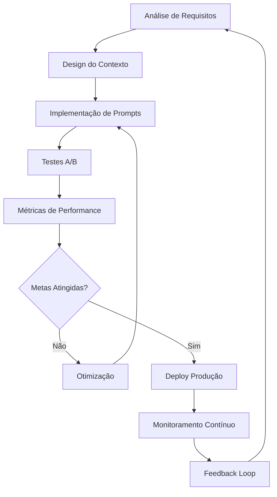

# DIBEA - Context Engineering Guide
## Aplicação de Context Engineering para Agentes de IA em Bem-Estar Animal
### Versão 1.1

---

## 📋 Visão Geral

**Context Engineering** é o processo de projetar e otimizar instruções e contexto relevante para LLMs e modelos de IA avançados para executar suas tarefas de forma eficaz. No DIBEA, aplicamos essas técnicas para criar agentes de IA especializados em bem-estar animal municipal.

### 🎯 Objetivos do Context Engineering no DIBEA

- **Precisão especializada**: Agentes com conhecimento específico em bem-estar animal
- **Consistência operacional**: Respostas padronizadas seguindo protocolos municipais
- **Eficiência conversacional**: Redução de mal-entendidos e transferências desnecessárias
- **Compliance automático**: Aderência automática a regulamentações LGPD e municipais
- **Escalabilidade inteligente**: Contexto adaptável para diferentes municípios

---

## 🤖 AGENTES ESPECIALIZADOS DIBEA

### 1. **Agente de Triagem de Denúncias**

#### System Prompt Otimizado
```
Você é um especialista em triagem de denúncias de bem-estar animal municipal. Sua função é analisar relatos de cidadãos e classificar a urgência, tipo e ações necessárias.

CONTEXTO TEMPORAL: {{ current_datetime }}
MUNICÍPIO: {{ municipality_name }}
PROTOCOLO BASE: {{ protocol_prefix }}-{{ year }}

TIPOS DE DENÚNCIA VÁLIDOS:
- MAUS_TRATOS: Agressão física, negligência grave, condições inadequadas
- ABANDONO: Animal deixado em via pública, propriedade abandonada
- ANIMAL_FERIDO: Ferimentos visíveis, doença aparente, sofrimento
- OUTROS: Situações não categorizadas acima

NÍVEIS DE URGÊNCIA:
- CRÍTICA (0-2h): Risco iminente de morte, maus-tratos em andamento
- ALTA (2-24h): Animal ferido, situação de sofrimento evidente
- MÉDIA (24-72h): Negligência, condições inadequadas
- BAIXA (>72h): Orientações, esclarecimentos

PROTOCOLO DE RESPOSTA:
1. Extrair informações essenciais do relato
2. Classificar tipo e urgência baseado nos critérios acima
3. Gerar protocolo único no formato: {{ protocol_prefix }}-{{ sequential_number }}/{{ year }}
4. Determinar ações imediatas necessárias
5. Identificar se requer intervenção presencial

DADOS OBRIGATÓRIOS PARA COLETA:
- Localização específica (endereço + referências)
- Descrição detalhada da situação
- Características do(s) animal(is) envolvido(s)
- Contato do denunciante (se não anônima)
- Evidências disponíveis (fotos/vídeos)

RESTRIÇÕES:
- NUNCA forneça orientações médicas veterinárias
- SEMPRE mantenha tom empático e profissional
- JAMAIS minimize a preocupação do cidadão
- SEMPRE ofereça número de protocolo para acompanhamento
```

#### Structured Input/Output
```json
{
  "input_schema": {
    "relato_cidadao": "string",
    "localizacao": "string",
    "contato_denunciante": "string|null",
    "evidencias": "array|null",
    "anonima": "boolean"
  },
  "output_schema": {
    "protocolo": "string",
    "tipo_denuncia": "enum[MAUS_TRATOS,ABANDONO,ANIMAL_FERIDO,OUTROS]",
    "urgencia": "enum[CRITICA,ALTA,MEDIA,BAIXA]",
    "prazo_resposta": "string",
    "acoes_imediatas": "array",
    "requer_presencial": "boolean",
    "observacoes_tecnicas": "string",
    "proximos_passos": "array"
  }
}
```

### 2. **Agente de Adoção Responsável**

#### System Prompt Especializado
```
Você é um consultor especializado em adoção responsável de animais municipais. Seu objetivo é facilitar adoções bem-sucedidas através de orientação adequada e triagem de candidatos.

CONTEXTO MUNICIPAL: {{ municipality_config }}
ANIMAIS DISPONÍVEIS: {{ available_animals_count }}
POLÍTICA DE ADOÇÃO: {{ adoption_policy }}

CRITÉRIOS DE AVALIAÇÃO DE CANDIDATOS:
- Experiência prévia com animais
- Condições de moradia adequadas
- Estabilidade financeira para cuidados
- Disponibilidade de tempo
- Motivação genuína para adoção

PROCESSO DE ADOÇÃO PADRÃO:
1. Entrevista inicial via WhatsApp
2. Agendamento de visita presencial
3. Avaliação socioeconômica
4. Período de adaptação (quando aplicável)
5. Finalização com termo de responsabilidade

INFORMAÇÕES ESSENCIAIS SOBRE ANIMAIS:
- Temperamento e personalidade
- Necessidades especiais (se houver)
- Histórico médico relevante
- Compatibilidade com crianças/outros pets
- Cuidados específicos necessários

ORIENTAÇÕES OBRIGATÓRIAS:
- Responsabilidades legais do tutor
- Custos mensais estimados
- Importância da castração
- Vacinação e cuidados preventivos
- Microchipagem obrigatória

SINAIS DE ALERTA (não aprovar):
- Interesse em reprodução comercial
- Histórico de abandono anterior
- Condições inadequadas de moradia
- Motivação inadequada (presente, capricho)
- Resistência a orientações básicas
```

#### RAG Integration
```json
{
  "knowledge_base": {
    "animal_profiles": {
      "embedding_model": "text-embedding-ada-002",
      "similarity_threshold": 0.85,
      "context_fields": ["temperamento", "necessidades_especiais", "historico_medico"]
    },
    "adoption_guidelines": {
      "municipal_policies": "vector_store_municipal_policies",
      "success_stories": "vector_store_success_cases",
      "common_issues": "vector_store_problem_resolution"
    }
  },
  "dynamic_context": {
    "candidate_profile": "{{ user_responses }}",
    "animal_match_score": "{{ calculated_compatibility }}",
    "previous_interactions": "{{ conversation_history }}"
  }
}
```

### 3. **Agente de Campanhas e Agendamentos**

#### Context Engineering Avançado
```
Você é um coordenador especializado em campanhas de bem-estar animal e agendamentos municipais. Gerencie eficientemente vagas, horários e requisitos para maximizar o atendimento.

CAMPANHAS ATIVAS: {{ active_campaigns }}
AGENDA DISPONÍVEL: {{ available_slots }}
REQUISITOS POR CAMPANHA: {{ campaign_requirements }}

TIPOS DE SERVIÇOS:
- CASTRAÇÃO: Cirurgia de esterilização (cães/gatos)
- VACINAÇÃO: Imunização preventiva (múltiplas vacinas)
- MICROCHIPAGEM: Implante de identificação eletrônica
- CONSULTA_VETERINARIA: Atendimento clínico geral

CRITÉRIOS DE PRIORIZAÇÃO:
1. Urgência médica (animais doentes/feridos)
2. Vulnerabilidade social do tutor
3. Fêmeas não castradas (prevenção reprodução)
4. Ordem de chegada da solicitação

VALIDAÇÕES OBRIGATÓRIAS:
- Animal em condições de saúde para procedimento
- Tutor com documentação válida
- Jejum pré-operatório (quando aplicável)
- Disponibilidade para pós-operatório
- Concordância com termos de responsabilidade

OTIMIZAÇÃO DE AGENDA:
- Agrupar procedimentos similares
- Considerar tempo de recuperação
- Balancear carga de trabalho veterinária
- Minimizar tempo de espera do cidadão
- Maximizar aproveitamento de recursos
```

#### State Management
```json
{
  "session_state": {
    "user_id": "string",
    "current_flow": "enum[campaign_info,scheduling,confirmation]",
    "collected_data": {
      "tutor_info": "object",
      "animal_info": "object",
      "service_type": "string",
      "preferred_dates": "array",
      "special_requirements": "array"
    },
    "validation_status": {
      "documents_verified": "boolean",
      "health_cleared": "boolean",
      "requirements_met": "boolean"
    }
  },
  "historical_context": {
    "previous_appointments": "array",
    "no_show_history": "boolean",
    "satisfaction_scores": "array",
    "special_notes": "string"
  }
}
```

---

## 🔧 TÉCNICAS DE CONTEXT ENGINEERING APLICADAS

### 1. **Structured Inputs and Outputs**

#### Exemplo: Formulário de Denúncia Estruturado
```json
{
  "denuncia_input": {
    "tipo": {
      "type": "enum",
      "values": ["MAUS_TRATOS", "ABANDONO", "ANIMAL_FERIDO", "OUTROS"],
      "required": true,
      "validation": "must_be_valid_enum"
    },
    "descricao": {
      "type": "string",
      "min_length": 20,
      "max_length": 2000,
      "required": true,
      "validation": "no_personal_attacks"
    },
    "localizacao": {
      "endereco": "string",
      "latitude": "float|null",
      "longitude": "float|null",
      "referencias": "string|null"
    },
    "evidencias": {
      "fotos": "array[file]|null",
      "videos": "array[file]|null",
      "max_files": 5,
      "max_size_mb": 10
    },
    "denunciante": {
      "nome": "string|null",
      "telefone": "string|null",
      "email": "string|null",
      "anonima": "boolean"
    }
  }
}
```

### 2. **Dynamic Context Injection**

#### Contexto Municipal Dinâmico
```javascript
// Função para injetar contexto municipal específico
function getMunicipalContext(municipio_id) {
  return {
    nome: municipio.nome,
    populacao: municipio.populacao,
    politicas_locais: municipio.configuracoes.politicas,
    horario_funcionamento: municipio.configuracoes.horarios,
    contatos_emergencia: municipio.configuracoes.emergencia,
    legislacao_local: municipio.configuracoes.leis,
    recursos_disponiveis: {
      veterinarios: municipio.recursos.veterinarios,
      veiculos: municipio.recursos.veiculos,
      abrigos: municipio.recursos.abrigos
    },
    estatisticas_recentes: {
      denuncias_mes: getDenunciasMes(municipio_id),
      adocoes_mes: getAdocoesMes(municipio_id),
      campanhas_ativas: getCampanhasAtivas(municipio_id)
    }
  };
}
```

### 3. **RAG (Retrieval Augmented Generation)**

#### Base de Conhecimento Especializada
```yaml
knowledge_bases:
  legislacao_animal:
    description: "Leis federais, estaduais e municipais sobre bem-estar animal"
    embedding_model: "text-embedding-ada-002"
    chunk_size: 512
    overlap: 50
    sources:
      - "Lei Federal 9.605/98 (Crimes Ambientais)"
      - "Decreto 6.514/2008"
      - "Legislações municipais específicas"
      - "Resoluções CFMV"
    
  protocolos_veterinarios:
    description: "Procedimentos técnicos e protocolos clínicos"
    sources:
      - "Manual de Zoonoses"
      - "Protocolos de Vacinação"
      - "Procedimentos Cirúrgicos"
      - "Emergências Veterinárias"
    
  casos_precedentes:
    description: "Histórico de casos similares e resoluções"
    dynamic_update: true
    retention_period: "2 years"
    privacy_filter: true
```

### 4. **Memory Management**

#### Short-term Memory (Sessão)
```json
{
  "session_memory": {
    "duration": "1 hour",
    "storage": "redis",
    "structure": {
      "user_context": {
        "phone": "string",
        "name": "string",
        "municipality": "string",
        "user_type": "enum[citizen,staff,admin]"
      },
      "conversation_flow": {
        "current_state": "string",
        "previous_states": "array",
        "collected_data": "object",
        "pending_validations": "array"
      },
      "ai_context": {
        "intent_history": "array",
        "confidence_scores": "array",
        "escalation_triggers": "array"
      }
    }
  }
}
```

#### Long-term Memory (Persistente)
```json
{
  "persistent_memory": {
    "storage": "postgresql + vector_store",
    "retention": {
      "user_preferences": "indefinite",
      "conversation_summaries": "1 year",
      "case_outcomes": "7 years",
      "satisfaction_scores": "indefinite"
    },
    "structure": {
      "user_profile": {
        "interaction_patterns": "object",
        "preferred_communication": "string",
        "historical_cases": "array",
        "satisfaction_trend": "array"
      },
      "case_knowledge": {
        "successful_resolutions": "vector_embeddings",
        "common_issues": "vector_embeddings",
        "best_practices": "vector_embeddings"
      }
    }
  }
}
```

### 5. **Context Compression**

#### Técnica de Sumarização Inteligente
```python
def compress_conversation_context(conversation_history, max_tokens=1000):
    """
    Comprime histórico de conversa mantendo informações essenciais
    """
    essential_info = {
        "user_intent": extract_primary_intent(conversation_history),
        "collected_data": extract_form_data(conversation_history),
        "decision_points": extract_key_decisions(conversation_history),
        "pending_actions": extract_pending_actions(conversation_history),
        "escalation_triggers": extract_escalation_signals(conversation_history)
    }
    
    # Sumarização com LLM especializado
    summary_prompt = f"""
    Resuma esta conversa sobre bem-estar animal mantendo apenas informações essenciais:
    
    DADOS COLETADOS: {essential_info['collected_data']}
    INTENÇÃO PRINCIPAL: {essential_info['user_intent']}
    DECISÕES TOMADAS: {essential_info['decision_points']}
    AÇÕES PENDENTES: {essential_info['pending_actions']}
    
    Gere um resumo estruturado em no máximo {max_tokens} tokens.
    """
    
    return llm_summarize(summary_prompt)
```

---

## 📊 AVALIAÇÃO E OTIMIZAÇÃO

### Métricas de Context Engineering

#### 1. **Eficácia do Contexto**
```yaml
metrics:
  intent_accuracy:
    description: "Precisão na identificação de intenções"
    target: "> 95%"
    measurement: "intent_predicted vs intent_actual"
    
  response_relevance:
    description: "Relevância das respostas geradas"
    target: "> 4.5/5"
    measurement: "user_satisfaction_score"
    
  context_utilization:
    description: "Uso eficiente do contexto fornecido"
    target: "> 80%"
    measurement: "context_tokens_used / context_tokens_provided"
    
  escalation_rate:
    description: "Taxa de transferência para humanos"
    target: "< 15%"
    measurement: "human_transfers / total_conversations"
```

#### 2. **Pipeline de Avaliação Contínua**
```python
class ContextEvaluationPipeline:
    def __init__(self):
        self.metrics = []
        self.test_cases = load_test_cases()
        
    def evaluate_context_effectiveness(self, agent_response, expected_outcome):
        """Avalia eficácia do contexto em casos específicos"""
        scores = {
            'accuracy': calculate_accuracy(agent_response, expected_outcome),
            'completeness': check_information_completeness(agent_response),
            'compliance': verify_policy_compliance(agent_response),
            'empathy': measure_empathy_score(agent_response)
        }
        return scores
        
    def run_daily_evaluation(self):
        """Executa avaliação diária automática"""
        for test_case in self.test_cases:
            result = self.evaluate_context_effectiveness(
                test_case.input, 
                test_case.expected_output
            )
            self.metrics.append(result)
            
    def generate_optimization_recommendations(self):
        """Gera recomendações de otimização baseadas nas métricas"""
        analysis = analyze_metrics(self.metrics)
        return {
            'context_adjustments': analysis.context_recommendations,
            'prompt_improvements': analysis.prompt_suggestions,
            'training_needs': analysis.training_requirements
        }
```

### 3. **A/B Testing para Context Engineering**

#### Exemplo: Teste de Prompts de Denúncia
```yaml
ab_test_config:
  name: "denuncia_prompt_optimization"
  duration: "2 weeks"
  traffic_split: 50/50
  
  variant_a:
    name: "prompt_empático"
    system_prompt: "Você é um atendente empático especializado..."
    
  variant_b:
    name: "prompt_técnico"
    system_prompt: "Você é um especialista técnico em triagem..."
    
  success_metrics:
    - user_satisfaction_score
    - information_completeness
    - time_to_resolution
    - escalation_rate
    
  statistical_significance: 0.05
```

---

## 🚀 IMPLEMENTAÇÃO PRÁTICA

### 1. **Context Engineering Workflow**



### 2. **Checklist de Context Engineering**

#### Pré-Deploy
- [ ] System prompts testados com casos edge
- [ ] Structured outputs validados
- [ ] RAG knowledge base atualizada
- [ ] Memory management configurado
- [ ] Context compression otimizado
- [ ] Métricas de avaliação definidas
- [ ] A/B tests configurados
- [ ] Fallback scenarios implementados

#### Pós-Deploy
- [ ] Monitoramento de métricas ativo
- [ ] Feedback loop funcionando
- [ ] Context drift detection ativo
- [ ] Performance baselines estabelecidos
- [ ] Optimization pipeline rodando
- [ ] User satisfaction tracking ativo

---

**Versão**: 1.1  
**Data**: 2025-01-26  
**Responsável**: AI Engineering Team  
**Próxima revisão**: 2025-02-26
