# DIBEA - Modelo de Entidade-Relacionamento (ERD)
## Versão 1.1 - Detalhado

### Diagrama Principal

```mermaid
erDiagram
    %% Entidades Principais
    USUARIO {
        uuid id PK
        string email UK
        string senha_hash
        string nome
        string telefone
        enum tipo "ADMIN, FUNCIONARIO, VETERINARIO, CIDADAO"
        boolean ativo
        timestamp created_at
        timestamp updated_at
        uuid municipio_id FK
    }

    MUNICIPIO {
        uuid id PK
        string nome
        string cnpj UK
        string endereco
        string telefone
        string email
        json configuracoes
        boolean ativo
        timestamp created_at
    }

    ANIMAL {
        uuid id PK
        string nome
        enum especie "CANINO, FELINO, OUTROS"
        string raca
        enum sexo "MACHO, FEMEA"
        enum porte "PEQUENO, MEDIO, GRANDE"
        date data_nascimento
        float peso
        string cor
        text temperamento
        text observacoes
        enum status "DISPONIVEL, ADOTADO, TRATAMENTO, OBITO, PERDIDO"
        string qr_code UK
        timestamp created_at
        timestamp updated_at
        uuid municipio_id FK
        uuid microchip_id FK
    }

    TUTOR {
        uuid id PK
        string cpf UK
        string rg
        string nome
        string email
        string telefone
        string endereco_completo
        string cep
        string cidade
        string estado
        enum tipo_moradia "CASA, APARTAMENTO, SITIO, OUTROS"
        boolean tem_experiencia
        text observacoes
        enum status "ATIVO, INATIVO, BLACKLIST"
        timestamp created_at
        timestamp updated_at
        uuid municipio_id FK
    }

    RGA {
        uuid id PK
        string numero UK
        date data_emissao
        date data_vencimento
        decimal valor_taxa
        boolean pago
        string certificado_url
        enum status "ATIVO, VENCIDO, CANCELADO"
        timestamp created_at
        uuid animal_id FK
        uuid tutor_id FK
        uuid municipio_id FK
    }

    MICROCHIP {
        uuid id PK
        string numero UK
        date data_aplicacao
        string veterinario_responsavel
        string local_aplicacao
        enum status "ESTOQUE, APLICADO, PERDIDO"
        timestamp created_at
        uuid municipio_id FK
    }

    ADOCAO {
        uuid id PK
        date data_solicitacao
        date data_aprovacao
        date data_entrega
        text motivo_interesse
        text observacoes_entrevista
        enum status "SOLICITADA, EM_ANALISE, APROVADA, REJEITADA, CONCLUIDA, CANCELADA"
        text motivo_rejeicao
        timestamp created_at
        timestamp updated_at
        uuid animal_id FK
        uuid tutor_id FK
        uuid funcionario_id FK
    }

    DENUNCIA {
        uuid id PK
        string protocolo UK
        enum tipo "MAUS_TRATOS, ABANDONO, ANIMAL_FERIDO, OUTROS"
        text descricao
        string endereco
        decimal latitude
        decimal longitude
        boolean anonima
        enum urgencia "BAIXA, MEDIA, ALTA, CRITICA"
        enum status "ABERTA, EM_ANDAMENTO, RESOLVIDA, ARQUIVADA"
        text resolucao
        date data_resolucao
        timestamp created_at
        timestamp updated_at
        uuid denunciante_id FK
        uuid funcionario_responsavel_id FK
        uuid municipio_id FK
    }

    CAMPANHA {
        uuid id PK
        string nome
        enum tipo "CASTRACAO, VACINACAO, MICROCHIPAGEM, EDUCATIVA"
        text descricao
        date data_inicio
        date data_fim
        string local
        integer vagas_total
        integer vagas_ocupadas
        decimal valor
        boolean gratuita
        enum status "PLANEJADA, ATIVA, ENCERRADA, CANCELADA"
        timestamp created_at
        timestamp updated_at
        uuid municipio_id FK
    }

    AGENDAMENTO {
        uuid id PK
        enum tipo "VISITA_ADOCAO, CAMPANHA, CONSULTA, OUTROS"
        datetime data_hora
        text observacoes
        enum status "AGENDADO, CONFIRMADO, REALIZADO, CANCELADO, FALTOU"
        text motivo_cancelamento
        timestamp created_at
        timestamp updated_at
        uuid tutor_id FK
        uuid animal_id FK
        uuid campanha_id FK
        uuid funcionario_id FK
    }

    HISTORICO_MEDICO {
        uuid id PK
        enum tipo "VACINA, MEDICAMENTO, CIRURGIA, EXAME, CONSULTA"
        string nome_procedimento
        text descricao
        date data_aplicacao
        string veterinario
        decimal peso_animal
        text observacoes
        timestamp created_at
        uuid animal_id FK
    }

    FOTO_ANIMAL {
        uuid id PK
        string url
        string nome_arquivo
        integer ordem
        boolean principal
        timestamp created_at
        uuid animal_id FK
    }

    DOCUMENTO_DENUNCIA {
        uuid id PK
        string url
        string nome_arquivo
        enum tipo "FOTO, VIDEO, DOCUMENTO"
        timestamp created_at
        uuid denuncia_id FK
    }

    CONVERSA_WHATSAPP {
        uuid id PK
        string numero_telefone
        string nome_contato
        enum status "ATIVA, ENCERRADA, TRANSFERIDA"
        json contexto
        timestamp created_at
        timestamp updated_at
        uuid tutor_id FK
        uuid funcionario_id FK
    }

    MENSAGEM_WHATSAPP {
        uuid id PK
        enum tipo "TEXTO, IMAGEM, AUDIO, DOCUMENTO"
        text conteudo
        string url_midia
        enum origem "BOT, USUARIO, FUNCIONARIO"
        boolean lida
        timestamp created_at
        uuid conversa_id FK
    }

    NOTIFICACAO {
        uuid id PK
        string titulo
        text conteudo
        enum tipo "EMAIL, SMS, WHATSAPP, PUSH"
        enum categoria "ADOCAO, DENUNCIA, CAMPANHA, SISTEMA"
        boolean enviada
        timestamp data_envio
        timestamp created_at
        uuid usuario_id FK
    }

    LOG_AUDITORIA {
        uuid id PK
        string tabela
        string operacao
        json dados_anteriores
        json dados_novos
        string ip_usuario
        string user_agent
        timestamp created_at
        uuid usuario_id FK
    }

    %% Relacionamentos
    MUNICIPIO ||--o{ USUARIO : "possui"
    MUNICIPIO ||--o{ ANIMAL : "gerencia"
    MUNICIPIO ||--o{ TUTOR : "cadastra"
    MUNICIPIO ||--o{ RGA : "emite"
    MUNICIPIO ||--o{ MICROCHIP : "controla"
    MUNICIPIO ||--o{ DENUNCIA : "recebe"
    MUNICIPIO ||--o{ CAMPANHA : "organiza"

    ANIMAL ||--o| MICROCHIP : "possui"
    ANIMAL ||--o{ FOTO_ANIMAL : "tem"
    ANIMAL ||--o{ HISTORICO_MEDICO : "possui"
    ANIMAL ||--o{ ADOCAO : "participa"
    ANIMAL ||--o{ AGENDAMENTO : "envolve"
    ANIMAL ||--o{ RGA : "registrado_em"

    TUTOR ||--o{ ADOCAO : "solicita"
    TUTOR ||--o{ RGA : "responsavel_por"
    TUTOR ||--o{ AGENDAMENTO : "agenda"
    TUTOR ||--o{ DENUNCIA : "faz"
    TUTOR ||--o{ CONVERSA_WHATSAPP : "participa"

    USUARIO ||--o{ ADOCAO : "analisa"
    USUARIO ||--o{ DENUNCIA : "resolve"
    USUARIO ||--o{ AGENDAMENTO : "atende"
    USUARIO ||--o{ CONVERSA_WHATSAPP : "atende"
    USUARIO ||--o{ NOTIFICACAO : "recebe"
    USUARIO ||--o{ LOG_AUDITORIA : "gera"

    DENUNCIA ||--o{ DOCUMENTO_DENUNCIA : "possui"

    CAMPANHA ||--o{ AGENDAMENTO : "gera"

    CONVERSA_WHATSAPP ||--o{ MENSAGEM_WHATSAPP : "contem"
```



### Índices Recomendados

```sql
-- Índices para performance
CREATE INDEX idx_animal_status ON animal(status);
CREATE INDEX idx_animal_municipio ON animal(municipio_id);
CREATE INDEX idx_animal_especie ON animal(especie);
CREATE INDEX idx_tutor_cpf ON tutor(cpf);
CREATE INDEX idx_tutor_municipio ON tutor(municipio_id);
CREATE INDEX idx_rga_numero ON rga(numero);
CREATE INDEX idx_rga_animal ON rga(animal_id);
CREATE INDEX idx_microchip_numero ON microchip(numero);
CREATE INDEX idx_denuncia_protocolo ON denuncia(protocolo);
CREATE INDEX idx_denuncia_status ON denuncia(status);
CREATE INDEX idx_denuncia_municipio ON denuncia(municipio_id);
CREATE INDEX idx_adocao_status ON adocao(status);
CREATE INDEX idx_agendamento_data ON agendamento(data_hora);
CREATE INDEX idx_historico_animal ON historico_medico(animal_id);
CREATE INDEX idx_foto_animal ON foto_animal(animal_id);
CREATE INDEX idx_conversa_telefone ON conversa_whatsapp(numero_telefone);
CREATE INDEX idx_mensagem_conversa ON mensagem_whatsapp(conversa_id);
CREATE INDEX idx_notificacao_usuario ON notificacao(usuario_id);
CREATE INDEX idx_log_usuario ON log_auditoria(usuario_id);
CREATE INDEX idx_log_tabela ON log_auditoria(tabela);

-- Índices compostos para consultas complexas
CREATE INDEX idx_animal_status_municipio ON animal(status, municipio_id);
CREATE INDEX idx_denuncia_status_municipio ON denuncia(status, municipio_id);
CREATE INDEX idx_adocao_status_data ON adocao(status, data_solicitacao);
CREATE INDEX idx_agendamento_tipo_data ON agendamento(tipo, data_hora);

-- Índices para busca textual
CREATE INDEX idx_animal_nome_gin ON animal USING gin(to_tsvector('portuguese', nome));
CREATE INDEX idx_tutor_nome_gin ON tutor USING gin(to_tsvector('portuguese', nome));
CREATE INDEX idx_denuncia_descricao_gin ON denuncia USING gin(to_tsvector('portuguese', descricao));
```

### Constraints e Validações

```sql
-- Constraints de domínio
ALTER TABLE animal ADD CONSTRAINT chk_animal_peso CHECK (peso > 0 AND peso < 200);
ALTER TABLE animal ADD CONSTRAINT chk_animal_data_nascimento CHECK (data_nascimento <= CURRENT_DATE);
ALTER TABLE tutor ADD CONSTRAINT chk_tutor_cpf CHECK (LENGTH(cpf) = 11);
ALTER TABLE rga ADD CONSTRAINT chk_rga_vencimento CHECK (data_vencimento > data_emissao);
ALTER TABLE denuncia ADD CONSTRAINT chk_denuncia_coordenadas CHECK (
    (latitude IS NULL AND longitude IS NULL) OR 
    (latitude BETWEEN -90 AND 90 AND longitude BETWEEN -180 AND 180)
);
ALTER TABLE agendamento ADD CONSTRAINT chk_agendamento_data_futura CHECK (data_hora > CURRENT_TIMESTAMP);
ALTER TABLE campanha ADD CONSTRAINT chk_campanha_datas CHECK (data_fim >= data_inicio);
ALTER TABLE campanha ADD CONSTRAINT chk_campanha_vagas CHECK (vagas_ocupadas <= vagas_total);

-- Triggers para auditoria
CREATE OR REPLACE FUNCTION audit_trigger() RETURNS TRIGGER AS $$
BEGIN
    INSERT INTO log_auditoria (tabela, operacao, dados_anteriores, dados_novos, usuario_id, created_at)
    VALUES (
        TG_TABLE_NAME,
        TG_OP,
        CASE WHEN TG_OP = 'DELETE' THEN row_to_json(OLD) ELSE NULL END,
        CASE WHEN TG_OP IN ('INSERT', 'UPDATE') THEN row_to_json(NEW) ELSE NULL END,
        current_setting('app.current_user_id', true)::uuid,
        NOW()
    );
    RETURN COALESCE(NEW, OLD);
END;
$$ LANGUAGE plpgsql;

-- Aplicar trigger em tabelas principais
CREATE TRIGGER audit_animal AFTER INSERT OR UPDATE OR DELETE ON animal
    FOR EACH ROW EXECUTE FUNCTION audit_trigger();
CREATE TRIGGER audit_tutor AFTER INSERT OR UPDATE OR DELETE ON tutor
    FOR EACH ROW EXECUTE FUNCTION audit_trigger();
CREATE TRIGGER audit_adocao AFTER INSERT OR UPDATE OR DELETE ON adocao
    FOR EACH ROW EXECUTE FUNCTION audit_trigger();
CREATE TRIGGER audit_denuncia AFTER INSERT OR UPDATE OR DELETE ON denuncia
    FOR EACH ROW EXECUTE FUNCTION audit_trigger();
```

### Views Úteis

```sql
-- View para animais disponíveis para adoção
CREATE VIEW v_animais_adocao AS
SELECT 
    a.id, a.nome, a.especie, a.raca, a.sexo, a.porte, a.data_nascimento,
    a.temperamento, a.qr_code,
    f.url as foto_principal,
    m.nome as municipio
FROM animal a
LEFT JOIN foto_animal f ON a.id = f.animal_id AND f.principal = true
JOIN municipio m ON a.municipio_id = m.id
WHERE a.status = 'DISPONIVEL';

-- View para dashboard de denúncias
CREATE VIEW v_dashboard_denuncias AS
SELECT 
    d.municipio_id,
    COUNT(*) as total,
    COUNT(CASE WHEN d.status = 'ABERTA' THEN 1 END) as abertas,
    COUNT(CASE WHEN d.urgencia = 'CRITICA' THEN 1 END) as criticas,
    AVG(EXTRACT(DAYS FROM (COALESCE(d.data_resolucao, CURRENT_DATE) - d.created_at::date))) as tempo_medio_resolucao
FROM denuncia d
WHERE d.created_at >= CURRENT_DATE - INTERVAL '30 days'
GROUP BY d.municipio_id;

-- View para relatório de adoções
CREATE VIEW v_relatorio_adocoes AS
SELECT 
    a.municipio_id,
    DATE_TRUNC('month', ad.data_solicitacao) as mes,
    COUNT(*) as total_solicitacoes,
    COUNT(CASE WHEN ad.status = 'CONCLUIDA' THEN 1 END) as adocoes_concluidas,
    ROUND(COUNT(CASE WHEN ad.status = 'CONCLUIDA' THEN 1 END) * 100.0 / COUNT(*), 2) as taxa_sucesso
FROM adocao ad
JOIN animal a ON ad.animal_id = a.id
GROUP BY a.municipio_id, DATE_TRUNC('month', ad.data_solicitacao);
```

---

**Versão**: 1.1  
**Data**: 2025-01-26  
**Entidades**: 16 principais + 2 auxiliares  
**Relacionamentos**: 25+ com integridade referencial  
**Índices**: 20+ otimizados para performance
